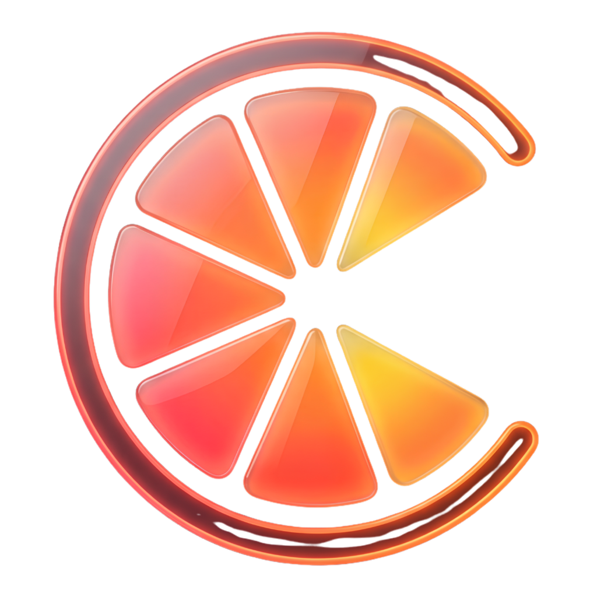

#  CitruSS UI

> **Vibrant Frosted Glassmorphic UI Kit inspired by citrus fruits.**  
> A modern, high-performance, and zero-dependency glassmorphic (frosted glass) UI library inspired by the colors and freshness of citrus fruits.

---

## 🌟 Key Features

- **✨ High-Fidelity Frosted Glassmorphism:** Eye-catching, modern, and premium designs using carefully curated HSL color palettes and harmonious gradients.
- **🧱 20+ Ready-to-Use Components:** Includes Accordion, Alerts, Avatars, Badges, Buttons, Cards, Carousel, Context Menu, Drawer, Dropdown, Modals, Wizard, and many more.
- **⚡ Zero-Dependency Interactive JS:** Lightweight, vanilla JavaScript logic for interactive components. Works framework-agnostically (suitable for Electron, React, Vue, or vanilla HTML projects).
- **🎨 Modular Sass Architecture:** Fully customizable variables (`_variables.scss`), robust mixins, and clean reset styles.
- **📚 Storybook Integration:** An integrated Storybook environment to preview, test, and document HTML/CSS components in real-time.
- **👁️ BackstopJS Visual Regression Testing:** Automated visual testing framework to catch unexpected UI and layout regressions.
- **🛡️ Stylelint Standards:** Enforces CSS/SCSS coding quality using Recess CSS property sorting and modern Sass standards.

---

## 📂 Project Structure

```text
CitruSS/
├── .storybook/            # Storybook configuration files
├── backstop_data/         # BackstopJS visual regression test references and reports
├── docs/                  # Project documentation and planning assets
├── src/                   # Main source code
│   ├── citruss.scss       # Main stylesheet combining all Sass modules
│   ├── core/              # Core Sass files (Variables, Mixins, Reset)
│   │   ├── _variables.scss
│   │   ├── _mixins.scss
│   │   └── _reset.scss
│   ├── components/        # SCSS component styles and Storybook stories
│   │   ├── _buttons.scss
│   │   ├── _cards.scss
│   │   ├── _modals.scss
│   │   ├── *.stories.js   # Storybook documentation stories
│   │   └── ...
│   └── js/                # Interactive Vanilla JS logic
│       ├── _dropdown.js
│       ├── _dialog.js
│       ├── index.js       # Main JS entry point exporting all components
│       └── ...
├── backstop.json          # BackstopJS configuration
├── package.json           # Package dependencies and npm scripts
├── stylelintrc.json       # SCSS/CSS linting rules
└── vite.config.js         # Vite bundler configuration
```

---

## 🚀 Getting Started

### Prerequisites

You need **Node.js** (v18 or higher) installed on your system to run the development environment.

### Installation

1. Clone the repository or navigate to the project directory:
   ```bash
   cd CitruSS
   ```

2. Install dependencies:
   ```bash
   npm install
   ```

---

## 🛠️ Available Scripts

Here are the standard npm scripts provided in this repository to accelerate your workflow:

| Command | Description |
| :--- | :--- |
| `npm run dev` | Boots up the local Vite development server. |
| `npm run build` | Builds and bundles production-ready CSS and JS assets inside `dist/`. |
| `npm run storybook` | Starts the Storybook documentation server (Default port: `6006`). |
| `npm run build-storybook`| Exports the Storybook documentation as a static site. |
| `npm run lint:css` | Lints the SCSS code and automatically fixes styling issues using `stylelint`. |
| `npm run test:ref` | Generates visual regression references (base screenshots) for testing. |
| `npm run test:test` | Runs automated visual tests against the generated reference screenshots. |

---

## 🎨 Design System Philosophy

The CitruSS design system is tailored around vibrant citrus themes:
- 🍊 **Orange:** Warm, energetic, and engaging calls to action.
- 🍋 **Lemon:** Sharp, bright alerts and highlights.
- 🍏 **Lime:** Refreshing success cues and confirmations.
- 🧊 **Frosted Glass:** Soft backdrop filters (`backdrop-filter: blur()`), ultra-thin white borders, and smooth ambient shadows creating three-dimensional depth.

### Quick Example

To use the glassmorphic card component in your markup:

```html
<!-- HTML Structure -->
<div class="citruss-card glass">
  <div class="citruss-card-header">
    <h3>🍋 Welcome to CitruSS!</h3>
  </div>
  <div class="citruss-card-body">
    <p>A fresh take on web aesthetics with high-quality frosted glass elements.</p>
    <button class="citruss-btn btn-orange">Explore More</button>
  </div>
</div>
```

---

## 📝 License

This project is licensed under the **MIT** License. See the `package.json` file for more details.

---
*Crafted with love and fresh citrus vibes by Truncgil Technology.* 🍊🍋
